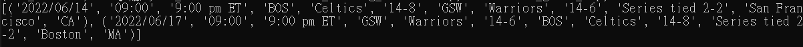

# Basketball_Scoring_Detection

# 專題動機與目的
  籃球是一項風靡全球的運動，根據教育部體育署的調查，有運動的民眾最常從事的運動項目中，籃球為第四名（8.8%），而沒有運動習慣的民眾最有可能從事的運動項目中，籃球則為第五名（3.6%）。而為確保比賽的公平性，每場籃球比賽都會錄製影片。近年來隨著方便快速的網路傳輸技術蓬勃發展，人們能輕鬆獲得大量的籃球比賽影片。透過這些影片，球迷得以關注喜愛的球星、教練能夠協助球隊分析戰術、球員亦可回顧自己的表現等。然而，觀看整段比賽影片是非常耗時的，在一場球賽中，最大亮點往往是進球的時刻，因此我們希望建立一個能在影片中自動判斷出進球時刻並剪輯進球片段的系統，幫助使用者快速得到想要的資訊。  
  除此之外，我們也發現到近年來由於新冠病毒的肆虐，大大改變了民眾的運動模式。根據教育部體育署的調查，在家運動的比例（15.3%）較109年（9.0%）大幅增加6.3%，同時為了不群聚打球，熱愛籃球的民眾們只能個別練習相關的訓練動作，對於打球的熱忱往往大不如前，運動頻率隨之下降。因此，我們希望建構一個智慧籃球運動的程式，讓使用者能夠記錄與監測自己的運動狀況，並透過與其他使用者互動、比較的方式，在疫情期間也可以提升打球的動力，讓他們重拾運動熱忱同時提高個人的免疫力。

# 相關研究
欲判斷是否進球，最直覺的方法是透過籃球是否通過籃筐的位置來判定，此方法雖簡單明瞭，但此方法問題在於，觀賞者所獲取的籃球影片，通常不會同時提供兩種以上的視角，因此若單以拍攝影片之鏡頭視角來判斷，可能會發生籃球與籃筐位置確實重疊，但籃球卻未真正進入籃筐的情況，將會造成判斷錯誤的問題。  
因此在這次專題中，需要解決
1. 辨識籃球和藍筐  
2. 確認是否進球  
這兩項問題，以下是我們找到的相關研究:  
* 參考文獻[1] Ratgeber, L., Ivankovic, Z., Gojkovic, Z., Milosevic, Z., Markoski, B., & Kostic–Zobenica, A. (2019). Video Mining in Basketball Shot and Game Analysis. Acta Polytechnica Hungarica, 16(1), 7-27.  
利用將畫面轉換成HSV顏色模型的方式辨識籃球和籃筐，並依照籃球在通過籃筐上方區域後是否通過籃框下方區域來決定是否進球。
  * 優點:每秒減少2/3的畫面使用來提高辨識速度而不影響準確度，因為利用球是否通過籃筐上方與下方作為判斷依據，這件事的發生不會快到以至於在減少的畫面集合中沒有被記錄下來
  * 缺點:籃球到籃筐下方區域時，可能會受到球員的干擾而影響判定結果，且此方法無法判斷籃球是從籃筐內部還是外部通過，可能會造成籃球與籃筐範圍重疊但未進入籃筐卻被誤判成進球的情況。  
* 參考文獻[2] Fu, X. B., Yue, S. L., & Pan, D. Y. (2021). Camera-based basketball scoring detection using convolutional neural network. International Journal of Automation and Computing, 18(2), 266-276.  
利用YOLO模型判斷出籃筐位置，並利用圖像差分找出移動中的物體，最後依照此物體是否有通過籃筐位置來判斷是否進球。
  * 優點:只要籃球有通過籃筐範圍就會被判斷成有進球，所以進球一定會被判斷出來
  * 缺點:無法判斷籃球是從籃筐內部還是外部通過，可能會造成籃球與籃筐範圍重疊但未進入籃筐卻被誤判成進球的情況。  
* 參考文獻[3] Huang, C. L., Shih, H. C., & Chen, C. L. (2006, July). Shot and scoring events identification of basketball videos. In 2006 IEEE International Conference on Multimedia and Expo (pp. 1885-1888). IEEE.  
用SVM(Support Vector Machine)來辨識籃球與籃筐，並將籃球依照是否被籃網覆蓋區分為在籃筐內、在籃筐外兩種類別。
  * 優點:可以在籃球和籃筐重疊時分辨出籃球是否在籃筐內
  * 缺點:過程中每一幀畫面都要判斷SVM的分數以確定籃球和籃筐的位置，故處理影片的速度較慢。  

# 設計原理
## 系統模型
所提方法的架構圖如下

接下來會依序說明各步驟
* 物件辨識模型 (用來辨識籃球與籃框)
  * 採用YOLOv4
  * 主要架構為
    * Backbone：CSPDarknet53
    * Neck：SPP + PAN
    * Head：YOLOv3
    

* 判斷進球
  1. 籃球是否高於籃筐:在進球前籃球一定需要高於籃筐，所以我們利用籃球最低點的位置是否高於籃筐最高點作為投籃開始的判斷依據，而投籃結束的依據則是籃球最高點低於籃筐最低點，我們會在這段區間內進行進球的判斷  
  2. 籃球中心點是否位於籃框範圍內且被籃網覆蓋
    * 判斷籃球中心點座標是否位於籃筐範圍內：在投籃過程中，籃球中心點必定要進入籃筐範圍內才有可能是一顆投進的球，因此我們將此標準作為進球的第一步判斷
    * 判斷籃球在是否在籃筐內部：當上述成立時，代表這幀照片有兩種可能的情況：
      1. 籃球在籃筐內部
      2. 籃球與籃筐位置重疊，但籃球在籃筐外部
    * 為了解決誤判的情況，在訓練籃筐模型時將標記的類別分為兩種：有進球的籃筐與沒進球的籃筐，如果籃筐範圍內有籃球而且籃網將籃球覆蓋住，就會被標示為有進球，其餘則標成沒進球  
 ## 網頁架構
我們的網頁主要是依據下圖的functional map做設計


# 程式碼說明
## 進球判斷程式碼說明
#### final.py

利用YOLOv4模型進行辨識，在判斷影片中的是否有進球後，將進球片段擷取出來。

檔案在Basketball_Scoring_Detection資料夾中，要執行此檔案需要先創建一個python3.6的環境

```bash
conda create --name (your env name) python=3.6
```

進入環境後執行以下指令下載requirements.txt

（執行網頁程式碼也需要此環境）

```bash
pip install -r requirements.txt
```

隨後下載model_datas到與final.py的同目錄下，並更改final.py第9、10行的影片輸入位置和名稱，及第13行的精華片段輸出位置，完成後即可使用。

```python
python final.py
```

## 網頁程式碼說明

### 首頁
#### weather.py
用來取得未來八小時的天氣預報 

```python
python weather.py
```

#### future_games_2.py
取得未來七天的賽程及資訊

資料來源: https://data.nba.com/data/10s/v2015/json/mobile_teams/nba/{year}/league/00_full_schedule.json

year為賽季開始的年份

例如現在的賽季為2021年度: https://data.nba.com/data/10s/v2015/json/mobile_teams/nba/2021/league/00_full_schedule.json


function用法:
* get_NBA_schedule(year) -> return **list** of (date,
                                                time,
                                                game_status,
                                                visiting_team,
                                                vteam_record,
                                                home_team,
                                                hteam_record,
                                                seri,
                                                arena_city,
                                                arena_state)
```python
get_NBA_schedule('2021')
```

result




### 上傳頁面
#### edit.py

MoviePyTest內有範例影片跟音樂
```python
audio = AudioFileClip(input_audio_name)
```
提供五首30秒音樂供使用者選擇，修改音樂檔名即可使用
```python
input_audio_name = "Run The Clock.mp3"
```

```python
AddSoundEffect(video, audio, origin_audio=false):
```
origin_audio用來選擇是否保留原影片的音軌

在此目錄執行edit.py可以看到加上音樂及慢動作兩種結果(同目錄)
```python
python edit.py
```
#### img_effect.py

每個函式代表不同的濾鏡

filter_imgs/origin.png為範例圖片
執行img_effect.py可以看到各種濾鏡的結果(同目錄)
```python
python img_effect.py
```

### 能力追蹤


# 網頁操作說明
## 如何進入網頁
執行網站需要linux系統，並創建虛擬環境

```bash
#安裝pip3
sudo apt-get -y install python3-pip
#安裝virtualenv
sudo pip3 install virtualenv
```

在目的資料夾中使用virtualenv建立一個虛擬環境

```bash
#建立虛擬環境
virtualenv VENV
#進入虛擬環境
source VENV/bin/activate
```
接著下載兩份requirements.txt，第二份在Basketball_Scoring_Detection資料夾裡

```bash
pip install -r requirements.txt
```

如果過程有報錯，可以嘗試使用conda下載

```bash
conda install ...
```

最後下載bballApp的資料夾，進入裡面後，輸入以下指令以啟動server，完成後前往顯示的網站連結即可

```python
python3 manage.py makemigrations
python3 manage.py migrate
#啟動surver
python3 manage.py runserver
```

如果啟動後有cannot import ... 的報錯（requirements.txt裡下載的套件）

可以試看看重新下載一次該套件

```python
pip uninstall ...
pip install ...
```
